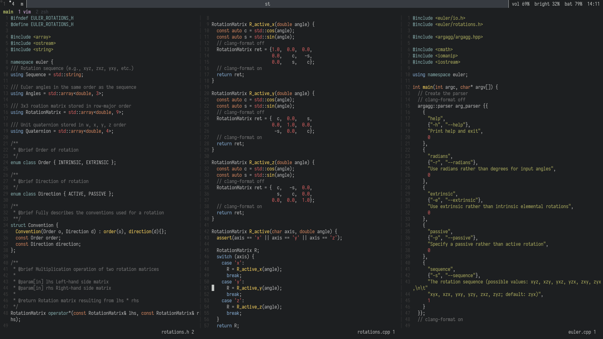

# dot_files
Setup and configuration files for my (C++) development environment. The master branch is intended to be used with [debian](https://www.debian.org) stable.

I use [dwm](https://dwm.suckless.org/) as my window manager along with other suckless tools ([st](https://st.suckless.org/), [dmenu](https://tools.suckless.org/dmenu/), [slock](https://tools.suckless.org/slock/)). I rely on [zsh](https://en.wikipedia.org/wiki/Z_shell), [vim](https://www.vim.org/), and [tmux](https://github.com/tmux/tmux/wiki) extensively in my development workflow.

